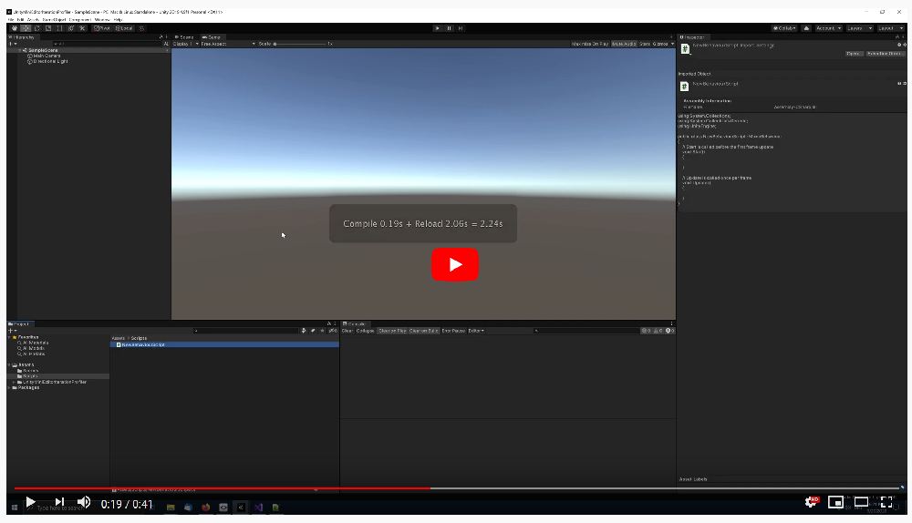

# Mini Editor Iteration Profiler for Unity

The Mini Editor Iteration Profiler shows the duration Unity needs to:
* Compile assemblies
* Perform an assembly reload
* Enter Play Mode
* Exit Play Mode

The timings are shown in the Scene and GameView, using Unity's EditorWindow [notifications API](https://docs.unity3d.com/ScriptReference/EditorWindow.ShowNotification.html).

Easy access to these timings allows you to spot whenever one of those timings worsened, 
which should be a signal to check what you recently added to the project,  that would explain the drop in performance.

I use this tool for a long time. It allowed me to witness how Unity upgrades affect the performance of my editor iteration time for example. Use Unity's Preferences window to configure what timings to show.

If you want to understand in detail how much time what costs in your editor iteration workflow, please check out Unity's [Editor Iteration Profiler](https://forum.unity.com/threads/introducing-the-editor-iteration-profiler.908390/).

# Installation

In order to use the Mini Editor Iteration Profiler, you have to add the package to your project. As of Unity 2019.3, Unity supports to add packages from git through the Package Manager window.

In Unity's Package Manager, choose "Add package from git URL" and insert one of the Package URL's you can find below.

## Package URL's

| Version  |     Link      |
|----------|---------------|
| 1.0.0 | https://github.com/pschraut/UnityMiniEditorIterationProfiler.git#1.0.0 |

